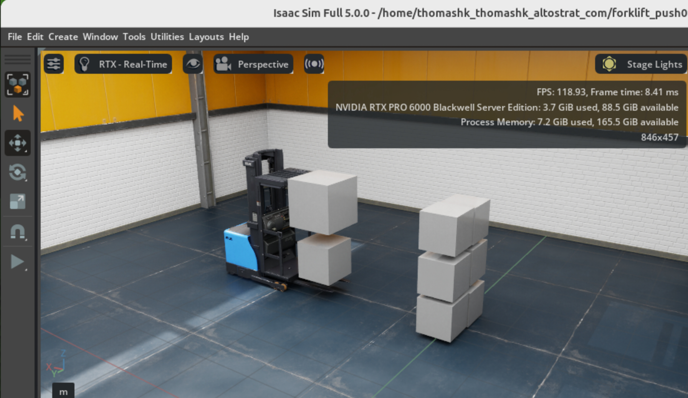
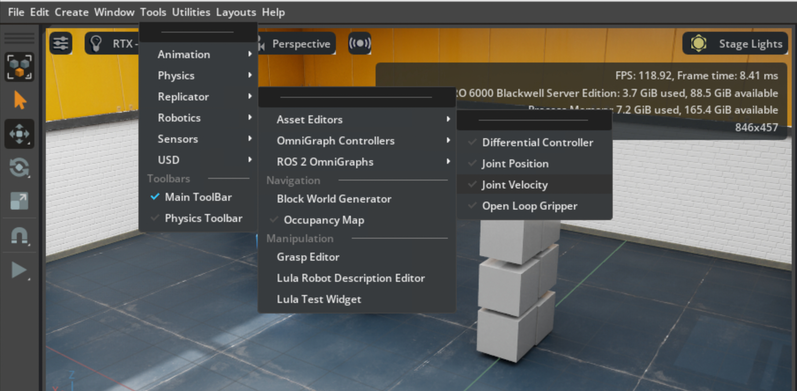
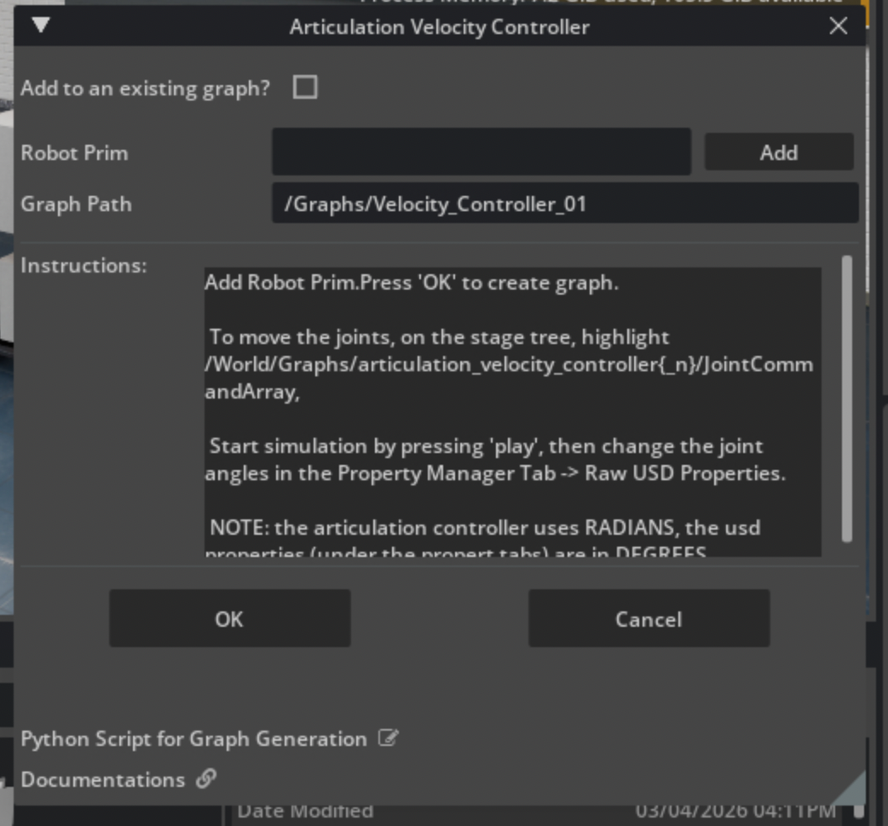
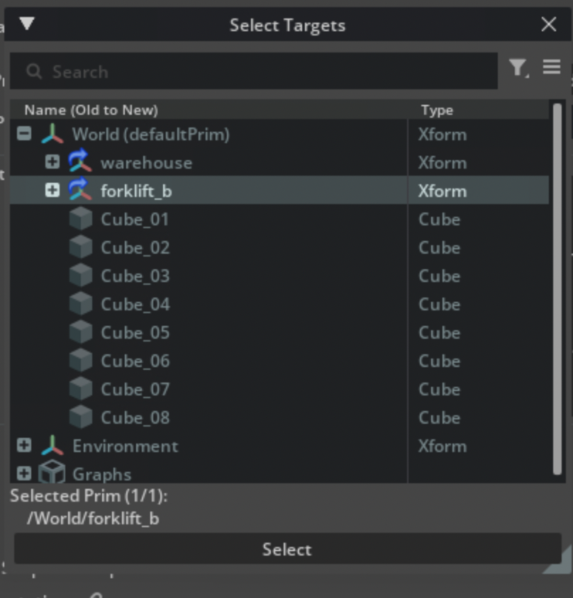
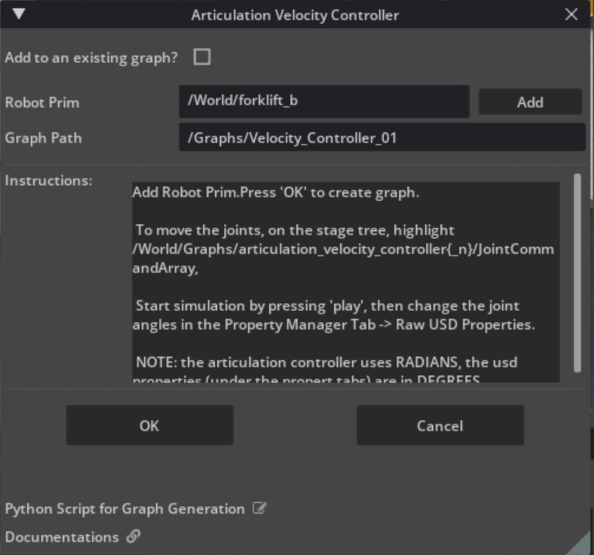
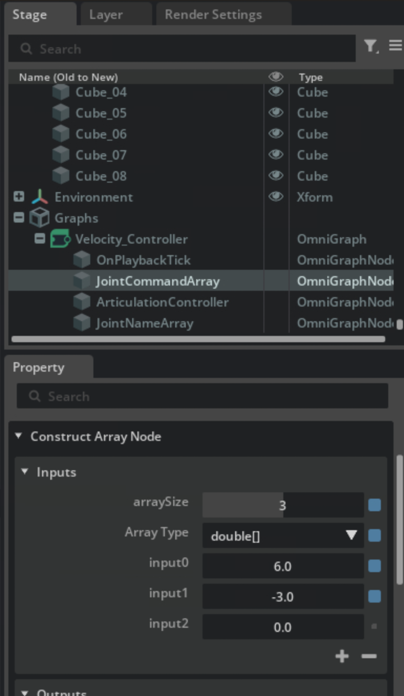

# NVIDIA Omniverse Isaac Sim - Digital Twin sample

Objective, we want to simulate in digital world when a forklift hits a stack of boxes. It is basic but powerful. 

Idea - we can easily change the weight of boxes, friction of the boxes, speed of the forklift . Then Omniverse Isaac Sim can offer real time simulation of the result. 

## Infrastructure and setup: 

- GCP - G4 instance with Omniverse Isaac Sim workstation from GCP Marketplace
- Thinlinc setup on Omniverse [link](https://github.com/thomasnyc/GCP_NVIDIA_Isaac_Sim_Thinlinc)
- usd file provided in this repo. This is the setup of the sample warehouse, forklift and boxes  

## Steps 

1. After started the Issac-sim environment (by running isaac-sim.sh), open the usd file provided:
   You will see the forklift and boxes in the warehouse environment.

2. We need to add the OmniGraph Controller with Join Velocity contorl to the environment:

3. Adding the Robot Prism to the Velocity Controller.

Pick the forklift_b as the target and click "Select"

Click "OK" 

4. Update the parameters to raise the forklift and accelerate the wheel

then click the run button at the left hand side panel . 
